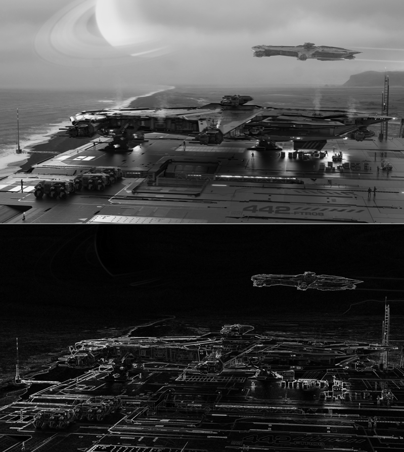

# Parallel Sobel Edge Detection

A sequential and OpenMP-parallelized Sobel edge detection program written in C++.

<table border="0">
  <tr>
    <td align="center" valign="middle">
      <br>
      <em>High-detail scene: dense edges distributed across the image</em>
    </td>
    <td align="center" valign="middle">
      <br>
      <em>High-contrast scene: sparse but prominent edges along silhouettes</em>
    </td>
  </tr>
</table>

## Requirements

- GCC 7.0 or higher (for C++17 support)
- OpenMP support (`-fopenmp`)
- A PGM grayscale image as input

If you are on the CIMS crunchy machines, load the correct module first:
module load gcc-13.2

## Build
make

This will compile the program and display the banner on success.
To clean the build:
make clean

## Usage
./sobel input.pgm output.pgm [mode] [seq|par] [threads]

| Argument   | Description                                      | Default |
|------------|--------------------------------------------------|---------|
| input.pgm  | Grayscale input image (P2 or P5 PGM format)      | —       |
| output.pgm | Output edge-detected image                       | —       |
| mode       | `l1` = \|Gx\|+\|Gy\| (fast), `l2` = sqrt(Gx²+Gy²) | `l1`    |
| seq\|par   | `seq` for sequential, `par` for OpenMP parallel  | `seq`   |
| threads    | Number of OpenMP threads (parallel mode only)    | `4`     |

### Examples

```bash
# Sequential
./sobel input.pgm output.pgm l1 seq

# Parallel with 8 threads
./sobel input.pgm output.pgm l1 par 8

# L2 magnitude, 4 threads
./sobel input.pgm output.pgm l2 par 4
```

## Input Images

Eight test images are provided, ordered from largest to smallest:

| File       | Size         |
|------------|--------------|
| input1.pgm | Largest      |
| input2.pgm |              |
| input3.pgm |              |
| input4.pgm |              |
| input5.pgm |              |
| input6.pgm |              |
| input7.pgm |              |
| input8.pgm | Smallest     |

To convert a JPEG to PGM format:
```bash
magick input.jpg -colorspace Gray input.pgm
```
